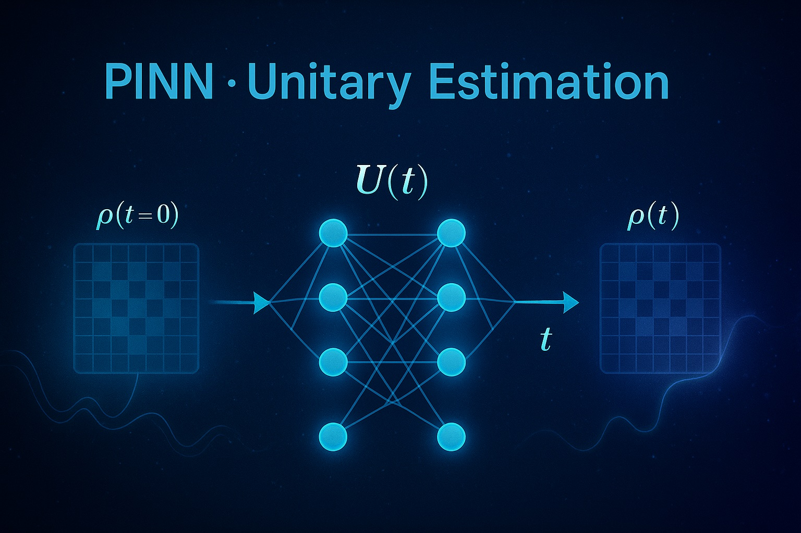

# PINN · Unitary Estimation

Applicstions of Physics-Informed Neural Networks (PINNs) for estimating quantum time-evolution unitary operators that governs the evolution of quantum density matrices for many-body systems (between 2 and 8 qubits). The same repository, along with the entire dataset used for the paper's result, can be downloaded in the following link:
https://udeconce-my.sharepoint.com/:f:/g/personal/antongonzalez_udec_cl/EqkQyIC3p9NPl68uff-9jLABRgsn5TGTRhSM09i7YEENsw?e=2bfouG

  

---

## 🚀 Overview

This project leverages deep learning models informed by physical principles to approximate the unitary operators $U(t)$ responsible for the evolution of quantum states in systems that evolve in time --i.e. are related with a time-dependent hamiltonian--. The goal is to train a neural network that, given a time $t$, learns to predict the unitary time-evolution operator $U(t)$ using a previously known set of unitary operators.

---

## 📁 Repository description

### `get_unitaries.py`
Generates and saves the known unitary matrices $U(t)$ used in training/testing dataset's generation.  
Supports systems with 2 to 8 qubits. The matrices are computed using the Magnus expansion up to third order.

### `gen_data.py`
Script for generating the data required for training and validate the models during training.
It simulates quantum systems by applying known unitaries to random initial states $\rho(t=0)$, producing datasets of the form $[ \rho_{\text{in}}, t, \rho_{\text{out}} ]$.

### `training_models.py`
Main training pipeline for the PINN architectures.  
It defines the model, loss functions (including physics-based constraints), and the training loop.

### `testing_models.py`
Applies trained models to generate multiple unitary matrices at differents times and, then, compare it with the theoretical unitary operator.
Computes the gate fidelity between the predicted $U(t)$ and the theoretical one.

### `gen_plots.py`
Contains utilities for visualizing training performance, loss evolution, fidelity, or output comparisons.

### `requirements.txt`
Shows the python version required to run this repository, along with the versions of the libraries also required.

---

## 🧠 Model Summary

The model receives a time parameter $t$ and aims to approximate $U(t)$ by learning a continuous representation of $U(t)$ through a physics-informed neural network.

---

## 📜 License

This project is licensed under the **MIT License**. See [LICENSE](./LICENSE.txt) for more info.

---

## 📫 Contact

For questions or collaborations, feel free to reach out via GitHub or email.
