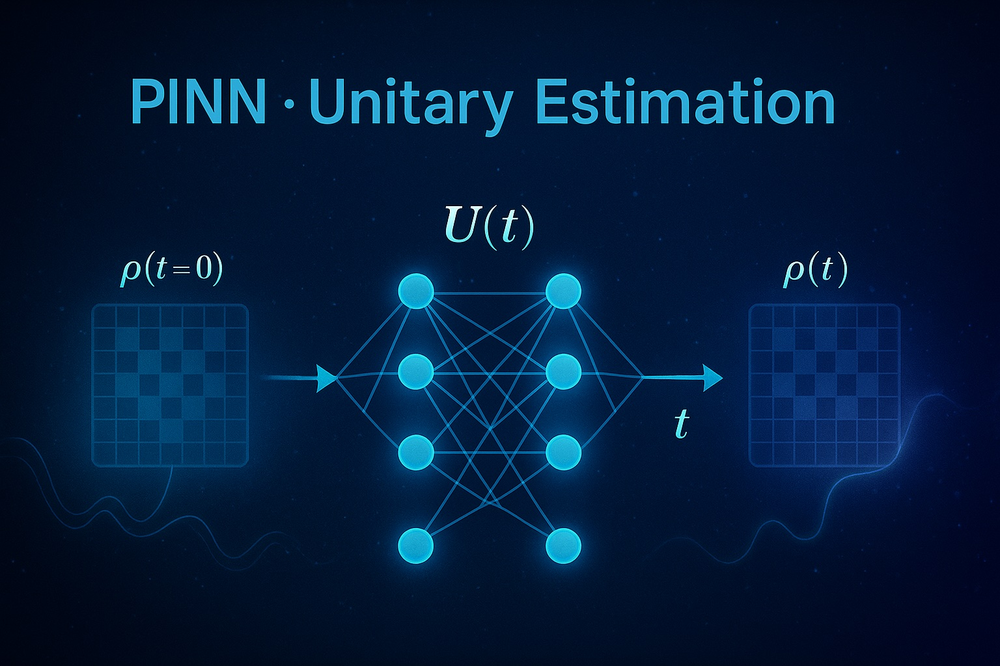

# PINN · Unitary Estimation

Physics-Informed Neural Networks (PINNs) for estimating the quantum time-evolution
unitary operators $U(t)$ that govern the dynamics of many-body quantum systems
(from 2 to 8 qubits) under time-dependent Hamiltonians.

📄 **Paper:** *Interpolation of unitaries with time-dependent Hamiltonians via Deep
Learning*, Machine Learning: Science and Technology (IOP Publishing).
*(DOI / link to be added upon publication.)*

<p align="center">
  
</p>

---

## 🚀 Overview

This project uses deep learning models informed by physical principles to approximate
the unitary operators $U(t)$ that drive the evolution of quantum states governed by
time-dependent Hamiltonians. Given a scalar time $t$, the network predicts the
corresponding time-evolution operator $U(t)$, trained on a finite set of unitaries
known at discrete times.

Two modeling strategies are used depending on system size:

- **2–6 qubits:** the network predicts the unitary operator $U(t)$ **directly**, for
  a fully non-zero Pauli Hamiltonian (the most general $N$-qubit Hamiltonian).
- **7–8 qubits:** the network predicts the coefficients of an **effective
  time-dependent Hamiltonian** $H_\text{eff}(t)$, from which $U(t)$ is reconstructed
  via the **second-order Magnus expansion** or **Trotterization**. This keeps the
  number of trainable parameters tractable at larger system sizes, where the
  Hamiltonian is restricted to nearest-neighbor Ising or $XYZ$ Heisenberg models.

Physical constraints (such as unitarity) are incorporated directly into the loss
function.

---

## ⚙️ Installation

```bash
git clone https://github.com/guerra-antonio/PINN_dynamics_estimation.git
cd PINN_dynamics_estimation
pip install -r requirements.txt
```

The code is implemented in Python with PyTorch. See `requirements.txt` for the exact
Python and library versions used.

---

## ▶️ Usage

The core pipeline (general Pauli Hamiltonian, 2–8 qubits) runs the scripts in the
following order:

1. **`gen_unitaries.py`** — precompute the target unitaries $U(t)$ at the known times.
2. **`gen_data.py`** — build the training datasets from those unitaries.
3. **`training_models.py`** — train the PINN models for all system sizes and time steps.
4. **`testing_models.py`** — evaluate the trained models and compute gate fidelities.

The notebooks (see below) reproduce the figures of the paper from the generated data.

---

## 📁 Repository structure

### Core pipeline

| File | Description |
|------|-------------|
| `gen_unitaries.py` | Precomputes and saves the target unitary matrices $U(t)$ for 2–8 qubits at the known training and testing times, using the second-order Magnus expansion. Results are stored in `dataframe/`. |
| `gen_data.py` | Generates the training datasets. Applies the precomputed unitaries to random initial density matrices $\rho(t=0)$, producing samples of the form $[\rho_\text{in}, t, \rho_\text{out}]$ for each time step $\Delta t \in \{0.1, 0.25, 0.5, 1.0\}$. |
| `training_models.py` | Main training pipeline. Trains a `UnitaryModel` for each system size (2–8) and each $\Delta t$. For $N \le 6$ it learns $U(t)$ directly; for $N \in \{7, 8\}$ it learns the effective Hamiltonian and propagates it via Magnus/Trotter. |
| `testing_models.py` | Loads the trained models, predicts $U(t)$ at 100 time points (including unseen times), and computes the gate fidelity against the exact unitary. Optionally applies the closest-unitary (SVD) projection. Saves results to `dataframe/fidelity_test.csv`. |

### Statistical analysis

| File | Description |
|------|-------------|
| `statistic_test.py` | Runs the statistical analysis over many independent Hamiltonian realizations (Ising / general Pauli), reporting mean fidelity and variability. Saves results as a `.pkl` file in `dataframe/`. |
| `statistic_test_unitary.py` | Ablation study of the **unitarity** loss term: compares models trained with and without the unitarity penalty across several time grids ($\Delta t$), to quantify its effect (Appendix C of the paper). |
| `run_statistic_xyz.py` | Statistical analysis for the nearest-neighbor **$XYZ$ Heisenberg** model across system sizes (2–8 qubits, many independent runs). |
| `run_singlecase_XYZ.py` | Single-realization $XYZ$ experiment for 7–8 qubits: samples a valid Hamiltonian, trains the model, evaluates fidelity, and saves the trained weights and results. |

### Figures (notebooks)

| Notebook | Reproduces |
|----------|-----------|
| `gen_plots.ipynb` | Fidelity figures for all system sizes. |
| `benchmark_timing.ipynb` | Inference-time benchmark for 2–6 qubits (PINN vs. geodesic interpolation). |
| `benchmark_timing_large.ipynb` | Inference-time benchmark for 7–8 qubits (Magnus / Trotter variants). |
| `plots_trace_distance.ipynb` | Trace-distance statistics between predicted and exact state evolution. |
| `plots_XYZ.ipynb` | Fidelity figures for the $XYZ$ Heisenberg model. |
| `plots_ablation_unitarity.ipynb` | Figures for the unitarity-term ablation study. |
| `state_dynamics.ipynb` | Population dynamics $\rho_{ii}(t)$ under predicted vs. exact unitaries. |

### Modules and data

| Folder | Contents |
|--------|----------|
| `req_prog/` | Core modules: model architectures, training routines, Magnus/Trotter propagators, and helper functions imported by the main scripts. |
| `req_prog_statistic/` | Modules supporting the statistical analyses (Ising and $XYZ$), including operator builders and per-realization test routines. |
| `dataframe/` | Generated data: precomputed unitaries, training datasets, and results (`.npy`, `.npz`, `.csv`, `.pkl`). |
| `models/` | Saved model weights (`.pth`). |
| `figures/` | Output figures. |

### Other files

| File | Description |
|------|-------------|
| `requirements.txt` | Required Python version and library dependencies. |
| `LICENSE.txt` | BSD 3-Clause license. |
| `banner.jpg` | Repository banner. |

---

## 🧠 Model summary

The model takes a scalar time $t$ as input and learns a continuous representation of
the time-evolution operator. For small systems ($N \le 6$) it outputs the unitary
$U(t)$ directly; for larger systems ($N \in \{7, 8\}$) it outputs the coefficients of
an effective Hamiltonian, from which $U(t)$ is computed via the Magnus expansion or
Trotterization. Unitarity and consistency with the quantum dynamics are enforced
through the loss function.

---

## 📚 Citation

If you use this code, please cite:

```bibtex
@misc{guerra2026interpolationunitariestimedependenthamiltonians,
      title={Interpolation of unitaries with time-dependent Hamiltonians via Deep Learning}, 
      author={Antonio Guerra and Daniel Uzcategui-Contreras and Aldo Delgado and Esteban S. Gómez},
      year={2026},
      eprint={2601.12619},
      archivePrefix={arXiv},
      primaryClass={quant-ph},
      url={https://arxiv.org/abs/2601.12619}, 
}
```

---

## 📜 License

This project is licensed under the **BSD 3-Clause License**.
See [LICENSE](./LICENSE.txt) for details.

---

## 📫 Contact

For questions or collaborations, reach out via GitHub
([@guerra-antonio](https://github.com/guerra-antonio)) or email.
